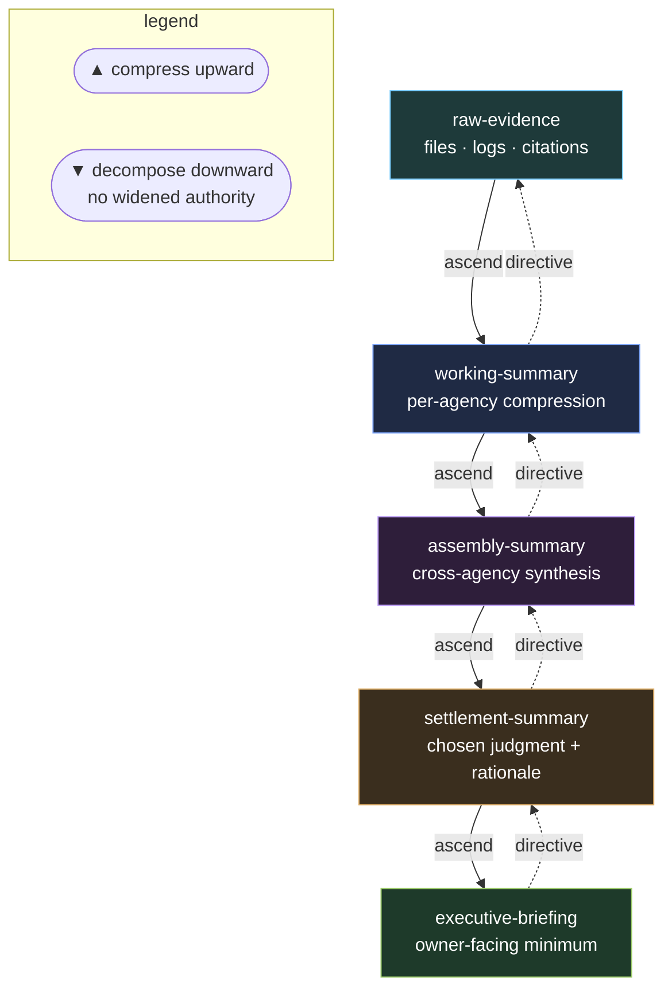

# Hierarchy and Summaries Protocol

Large societies do not scale by showing every raw proposal to every decider.

They scale by compressing upward and decomposing downward.

Escalation downward (to a lower tier) must be justified by uncertainty, disagreement, or risk. Decomposition downward may never widen authority beyond the parent settlement.

---

## Summary tiers

| Tier | Purpose |
| --- | --- |
| `raw-evidence` | Source files, logs, direct citations |
| `working-summary` | Local agency compression of raw evidence |
| `assembly-summary` | Cross-agency synthesis before settlement |
| `settlement-summary` | Chosen judgment and rationale |
| `executive-briefing` | Owner-facing summary with only necessary detail |

Escalation to a lower tier must be justified by uncertainty, disagreement, or risk.

---

## Ascending hierarchy

Worker agencies produce working summaries.
Assembly roles combine them into assembly summaries.
Settlement produces the society's judged result.
Owner-briefing compresses that result for human review.

---

## Descending hierarchy

High-level settlements may be decomposed into narrower directives.

A descending directive records:

- parent settlement
- delegated scope
- authority boundary
- allowed outputs
- completion signal

No directive may widen authority beyond the parent settlement.
