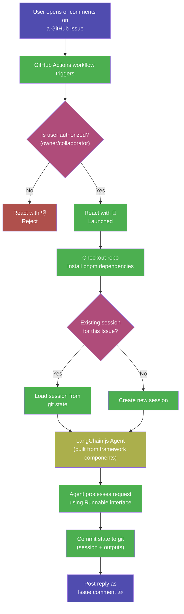

# Githubification Analysis — LangChain.js

### How this repository could become a GitHub Action based mechanism

---

## Executive Summary

This analysis examines how `githubification-langchainjs` — a fork of [LangChain.js](https://github.com/langchain-ai/langchainjs), the most widely-used JavaScript framework for building LLM-powered applications — could be converted into a GitHub Action based mechanism using the [Githubification](https://github.com/japer-technology/githubification) methodology and [GitHub Minimum Intelligence (GMI)](https://github.com/japer-technology/github-minimum-intelligence) as the proven execution pattern.

**Classification**: Type 1 — AI Agent Repo (framework for building agents)
**Recommended Strategy**: Composition — build the Githubification agent from LangChain.js's own components
**Infrastructure Gap**: Zero — Node.js and pnpm are the only requirements; both are available on every GitHub Actions runner

---

## The Four GitHub Primitives

Githubification maps every repository to four GitHub primitives. For LangChain.js, all four map cleanly with no infrastructure gap:

| GitHub Primitive | Role | LangChain.js Mapping |
| --- | --- | --- |
| **GitHub Actions** | Compute | Executes LangChain.js chains, agents, and tools directly on standard runners — no databases, containers, or persistent services required |
| **Git** | Storage & Memory | The monorepo stores framework code, agent state, conversation history (JSONL sessions), and all outputs — versioned and auditable |
| **GitHub Issues** | User Interface | Each issue becomes a conversation thread — users describe what they need, the agent responds using LangChain.js capabilities |
| **GitHub Secrets** | Credential Store | LLM API keys (OpenAI, Anthropic, Google, etc.) plus existing CI tokens — the provider-agnostic architecture means the LLM choice is a secret, not a code change |

This is the most complete primitive mapping of any Githubification candidate. Where projects like Agent Zero (Flask server, FAISS, Docker) or AutoGPT (PostgreSQL, Redis, RabbitMQ) require infrastructure that GitHub Actions cannot provide, LangChain.js needs only `node` and `pnpm` — both pre-installed on every Actions runner.

---

## Why LangChain.js Is an Ideal Candidate

### 1. Zero Infrastructure Gap

| Requirement | Available on GitHub Actions? |
| --- | --- |
| Node.js v24.x | ✅ Yes (`actions/setup-node`) |
| pnpm v10.14.0 | ✅ Yes (`pnpm/action-setup`) |
| TypeScript compiler | ✅ Yes (dev dependency) |
| LLM API access | ✅ Yes (via GitHub Secrets) |
| Database | Not needed |
| Docker | Not needed |
| Persistent server | Not needed |
| GPU | Not needed |

The entire development lifecycle — install, build, lint, test — already runs natively in this repo's 20+ GitHub Actions workflows. Adding issue-driven agent execution is adding one more workflow alongside existing infrastructure.

### 2. The Runnable Interface Is the Githubification Contract

Every LangChain.js component — chat models, tools, retrievers, chains, agents — implements the `Runnable` interface:

```typescript
interface Runnable<Input, Output> {
  invoke(input: Input, config?: RunnableConfig): Promise<Output>;
  stream(input: Input, config?: RunnableConfig): AsyncGenerator<Output>;
  batch(inputs: Input[], config?: RunnableConfig): Promise<Output[]>;
}
```

This uniform interface means:
- **Any capability can be triggered through `invoke()`** — no component-specific integration code
- **Streaming via `stream()`** — the agent could update Issue comments progressively as it generates output
- **Batch processing via `batch()`** — multiple requests from a single Issue

The Runnable interface is the natural API surface for a Githubified LangChain.js. Where other projects must design the interface between agent and codebase, LangChain.js has already designed it.

### 3. Provider-Agnostic Architecture

LangChain.js supports 30+ LLM providers through a common interface:

```typescript
import { ChatOpenAI } from "@langchain/openai";
import { ChatAnthropic } from "@langchain/anthropic";
import { ChatGoogleGenerativeAI } from "@langchain/google-genai";
```

The repository owner chooses the provider by setting the appropriate API key in GitHub Secrets. The Githubification layer calls `model.invoke()` — the provider abstraction handles the rest. This is a level of flexibility no other Githubification candidate offers.

### 4. Monorepo as Modular Context

The monorepo's package structure provides natural context boundaries:

| Package | Context Scope |
| --- | --- |
| `@langchain/core` | Abstractions, type system, interface contracts |
| `langchain` | Agent patterns, chain composition, memory |
| `@langchain/openai` | OpenAI integration specifics |
| `@langchain/anthropic` | Anthropic/Claude specifics |
| `@langchain/community` | Community integrations |
| `libs/langchain-standard-tests` | Provider behavior contracts |
| `examples/` | Real-world usage patterns |

A question about "how do I use structured output with OpenAI?" loads `@langchain/core` and `@langchain/openai` — not the 28 other provider packages. Package boundaries are context boundaries.

### 5. Existing CI as Quality Gate

With 20 GitHub Actions workflows already in place, the repo defines what "correct" looks like:

| Workflow | Purpose |
| --- | --- |
| `ci.yml` | Linting on PRs |
| `unit-tests-langchain-core.yml` | Core unit tests |
| `unit-tests-langchain.yml` | Main package tests |
| `unit-tests-integrations.yml` | Provider tests |
| `standard-tests.yml` | Provider conformance |
| `compatibility.yml` | Cross-version tests |
| `platform-compatibility.yml` | Environment tests |
| `test-exports.yml` | Export validation |
| `codeql.yml` | Security scanning |
| `format.yml` | Code formatting |

Any code the agent generates or modifies would pass through these existing quality gates.

---

## The Composition Strategy

Previous Githubification case studies reveal five strategies:

| Strategy | Description | Example |
| --- | --- | --- |
| **Native** | Agent designed for GitHub from the start | GMI, GitClaw |
| **Wrapping** | Existing agent wrapped without modification | OpenClaw |
| **Substitution** | Incompatible agent replaced with GitHub-native one | Agent Zero |
| **Transformation** | Agent interaction model fundamentally changed | Agenticana |
| **Channel Addition** | GitHub added as another communication channel | MicroClaw |

LangChain.js introduces a sixth: **Composition**. Because the subject is a framework for building agents, the Githubification agent can be built from the framework's own components. The agent that responds to Issues would be built **with** LangChain.js — using its chat models, tools, memory, and chain abstractions — running on GitHub Actions.

| Strategy | What runs on GitHub Actions | Relationship to original code |
| --- | --- | --- |
| Native | The original agent, unchanged | Identical |
| Wrapping | A wrapper around the agent | Encapsulates |
| Substitution | A new, lightweight agent | Reads original as context |
| Composition | A new agent built with the framework | Uses original as building material |

The composition strategy means the Githubified agent is not separate from LangChain.js — it **is** LangChain.js. Every Runnable, every Tool, every Chain in the framework is available to the agent. The framework's own test infrastructure validates the agent's components.

---

## Proposed Architecture

### How It Would Work



### The Lifecycle — Modeled on GMI

Following the proven [GMI pattern](https://github.com/japer-technology/github-minimum-intelligence), the lifecycle is:

1. **Trigger** — Issue opened or commented → GitHub Actions workflow fires
2. **Authorize** — Verify the actor is a repo owner, member, or collaborator
3. **Indicate** — React with 🚀 to show the agent is working
4. **Setup** — Checkout repo, install pnpm dependencies, build `@langchain/core`
5. **Load/Create Session** — Map `issue #N` → session file; load conversation history from git
6. **Execute** — Run the LangChain.js-powered agent using the Runnable interface
7. **Commit** — Save session state and any outputs to git
8. **Reply** — Post the agent's response as an Issue comment; react with 👍

### Proposed File Structure

```
.githubification-langchainjs/
├── lifecycle/
│   └── agent.ts                # Core agent orchestrator (LangChain.js composition)
├── state/
│   ├── issues/                 # Issue-to-session mappings (e.g., 1.json)
│   └── sessions/               # Conversation history (JSONL files)
├── .pi/
│   ├── settings.json           # LLM provider, model, thinking level config
│   └── APPEND_SYSTEM.md        # System prompt with LangChain.js expertise
├── package.json                # Runtime dependencies (@langchain/core, provider packages)
├── AGENTS.md                   # Agent identity and personality
└── VERSION                     # Installed version

.github/workflows/
└── githubification-agent.yml   # The single workflow that powers everything
```

### The Workflow File

A single GitHub Actions workflow modeled on [GMI's proven pattern](https://github.com/japer-technology/githubification/blob/main/.github/workflows/github-minimum-intelligence-agent.yml):

```yaml
name: githubification-langchainjs-agent

on:
  issues:
    types: [opened]
  issue_comment:
    types: [created]

permissions:
  contents: write
  issues: write

jobs:
  run-agent:
    runs-on: ubuntu-latest
    concurrency:
      group: langchainjs-issue-${{ github.event.issue.number }}
      cancel-in-progress: false
    if: >-
      (github.event_name == 'issues')
      || (github.event_name == 'issue_comment'
          && !endsWith(github.event.comment.user.login, '[bot]'))
    steps:
      - name: Authorize
        # Verify actor is owner/collaborator (same pattern as GMI)

      - name: Checkout
        uses: actions/checkout@v4

      - name: Setup pnpm
        uses: pnpm/action-setup@v4

      - name: Setup Node.js
        uses: actions/setup-node@v4
        with:
          node-version-file: ".nvmrc"
          cache: "pnpm"

      - name: Install & Build
        run: |
          pnpm install --frozen-lockfile
          pnpm --filter @langchain/core build

      - name: Run Agent
        env:
          OPENAI_API_KEY: ${{ secrets.OPENAI_API_KEY }}
          ANTHROPIC_API_KEY: ${{ secrets.ANTHROPIC_API_KEY }}
          GEMINI_API_KEY: ${{ secrets.GEMINI_API_KEY }}
          GITHUB_TOKEN: ${{ secrets.GITHUB_TOKEN }}
        run: npx tsx .githubification-langchainjs/lifecycle/agent.ts
```

### The Composition Agent

The agent would be built from LangChain.js's own building blocks:

```typescript
// .githubification-langchainjs/lifecycle/agent.ts (conceptual)
import { ChatOpenAI } from "@langchain/openai";
import { HumanMessage, SystemMessage } from "@langchain/core/messages";
import { StructuredTool } from "@langchain/core/tools";

// 1. Load session from git state
// 2. Initialize the LLM using provider config from settings.json
// 3. Build an agent using LangChain.js tools and chains
// 4. Invoke with the user's Issue content
// 5. Commit session state and reply
```

This is the composition strategy in action: the agent IS LangChain.js, demonstrating the framework by using it.

---

## What the Agent Could Do

### Immediate Capabilities (Issue-Driven)

| User Action | Agent Response |
| --- | --- |
| "How do I use structured output with GPT-4o?" | Generates working code using `@langchain/openai` with `withStructuredOutput()` |
| "Show me how to build a RAG pipeline" | Composes a retrieval chain using document loaders, embeddings, and retrievers |
| "What's the difference between `invoke` and `stream`?" | Explains with examples from `@langchain/core/runnables` |
| "Run the core unit tests" | Executes `pnpm --filter @langchain/core test` and reports results |
| "Help me create a new provider integration" | Walks through the scaffolding process with `npx create-langchain-integration` |

### Advanced Capabilities

| Capability | How It Works |
| --- | --- |
| **Live code execution** | The agent can `invoke()` LangChain.js chains directly on the runner — not just describe them |
| **Multi-provider demos** | Switch between OpenAI, Anthropic, Google by changing which Secret is set |
| **Test validation** | Run specific test suites and report pass/fail in the Issue |
| **Code generation** | Generate LangChain.js code, commit it, and validate via existing CI |
| **Framework exploration** | Load specific packages as context and answer deep architectural questions |

---

## Implementation Phases

### Phase 1 — Foundation (GMI-Based)

Install [GitHub Minimum Intelligence](https://github.com/japer-technology/github-minimum-intelligence) to establish the issue-driven agent pattern:

- [ ] Add the GMI workflow file to `.github/workflows/`
- [ ] Add the GMI agent folder (`.github-minimum-intelligence/`)
- [ ] Configure LLM provider via `settings.json`
- [ ] Add LLM API key to GitHub Secrets
- [ ] Verify: open an issue, get a response — the agent works

This phase delivers immediate value: an AI agent that lives in the repo, responds to Issues, and has the entire LangChain.js codebase as context. The agent uses GMI's `pi-coding-agent` — not yet composed from LangChain.js itself.

### Phase 2 — Composition Agent

Replace or augment the GMI agent with one built from LangChain.js components:

- [ ] Create `.githubification-langchainjs/` folder structure
- [ ] Build `lifecycle/agent.ts` using LangChain.js chat models, tools, and chains
- [ ] Implement session management (issue → session mapping, git-committed state)
- [ ] Configure provider selection via `settings.json` + GitHub Secrets
- [ ] Add the `githubification-agent.yml` workflow
- [ ] Verify: open an issue, get a response powered by LangChain.js's own Runnable interface

### Phase 3 — Framework Capabilities

Extend the composition agent with LangChain.js-specific tools:

- [ ] Tool: Execute LangChain.js chains on the runner (live code execution)
- [ ] Tool: Run specific test suites and report results
- [ ] Tool: Generate provider integration scaffolding
- [ ] Tool: Load package-specific context (selective monorepo loading)
- [ ] Tool: Create changesets for versioned contributions

### Phase 4 — Self-Demonstration

The agent becomes a living demonstration of LangChain.js:

- [ ] Users interact with LangChain.js capabilities through Issues
- [ ] The agent composes chains, calls tools, and streams responses — all using the framework
- [ ] Every interaction is a working example of LangChain.js in action
- [ ] The conversation history (committed to git) serves as documentation

---

## Comparison with Other Githubified Repos

| Dimension | GMI (Native) | Agent Zero (Substitution) | AutoGPT (Preparation) | **LangChain.js (Composition)** |
| --- | --- | --- | --- | --- |
| **Infrastructure needs** | Node.js (Bun) | Flask, FAISS, Docker | PostgreSQL, Redis, RabbitMQ, Docker | **Node.js, pnpm** |
| **Runs on Actions?** | ✅ Yes | ❌ No (substituted) | ❌ No (not yet) | **✅ Yes** |
| **Strategy** | Native | Substitution | TBD | **Composition** |
| **Agent relationship** | Agent IS the repo | Different agent reads codebase | No agent yet | **Agent IS BUILT FROM the framework** |
| **LLM flexibility** | Multi-provider | Single (pi-mono) | Platform-locked | **30+ providers via abstraction** |
| **Dependencies** | 1 (pi-coding-agent) | 1 (pi-coding-agent) | 54+ Python packages | **Framework packages (already in repo)** |

---

## Key Advantages of Githubifying LangChain.js

1. **Zero infrastructure gap** — The framework runs natively on GitHub Actions runners. No databases, no containers, no persistent services.

2. **Self-demonstrating** — The agent IS LangChain.js. Every interaction demonstrates the framework's capabilities — chat models, tools, chains, streaming, structured output.

3. **Provider freedom** — Users choose their LLM provider by setting a GitHub Secret. Switch from OpenAI to Anthropic to Google without code changes.

4. **Existing quality gates** — 20 GitHub Actions workflows already validate correctness. Agent-generated code passes through the same CI as human contributions.

5. **Selective context** — The monorepo's package boundaries enable loading only the relevant packages for each query, improving accuracy and performance.

6. **Auditable by design** — Every conversation, every code generation, every agent action is committed to git. Full audit trail, rollback capability, and version history.

7. **AI-agent-ready** — The `AGENTS.md` (12KB) already documents everything an AI agent needs: structure, commands, conventions, abstractions, testing patterns.

---

## Risks and Mitigations

| Risk | Mitigation |
| --- | --- |
| **Monorepo build time** — Full `pnpm install` and build may be slow on Actions | Build only the required packages (`--filter @langchain/core`); cache `node_modules` with `actions/cache` |
| **Actions timeout** — Complex LLM interactions may exceed the 6-hour job limit | Set reasonable token limits; break complex tasks into multi-turn conversations |
| **API costs** — LLM API calls cost money per token | Owner controls which provider/model is used; cheaper models available for simple queries |
| **State conflicts** — Concurrent issue comments may cause git conflicts | Use concurrency groups (one agent run per issue at a time, as GMI does) |
| **Context window limits** — The full monorepo exceeds any LLM's context window | Load packages selectively based on the query; use the monorepo structure as natural context boundaries |

---

## Conclusion

LangChain.js is among the strongest candidates for Githubification across all repositories analyzed by the [Githubification project](https://github.com/japer-technology/githubification). It has:

- **Zero infrastructure gap** — everything runs on a standard GitHub Actions runner
- **A uniform interface** — the Runnable contract makes every component invocable through the same pattern
- **Provider agnosticism** — the LLM choice is a configuration secret, not a code change
- **A natural composition strategy** — the agent can be built from the framework's own building blocks
- **Existing CI infrastructure** — 20 workflows that define and enforce quality
- **AI readiness** — `AGENTS.md` provides comprehensive onboarding for any AI agent

The path from "framework in a repo" to "framework running on GitHub" requires adding one workflow file and one lifecycle folder. GitHub is the runtime. GitHub is the interface. GitHub is the infrastructure.

> **The repo no longer needs to be cloned and installed. It executes directly on GitHub, powered by its own components, accessible through Issues.**
