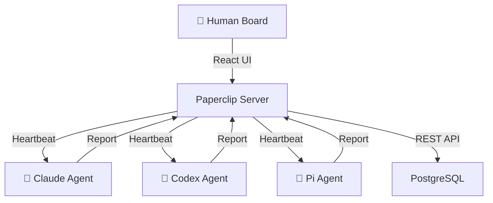
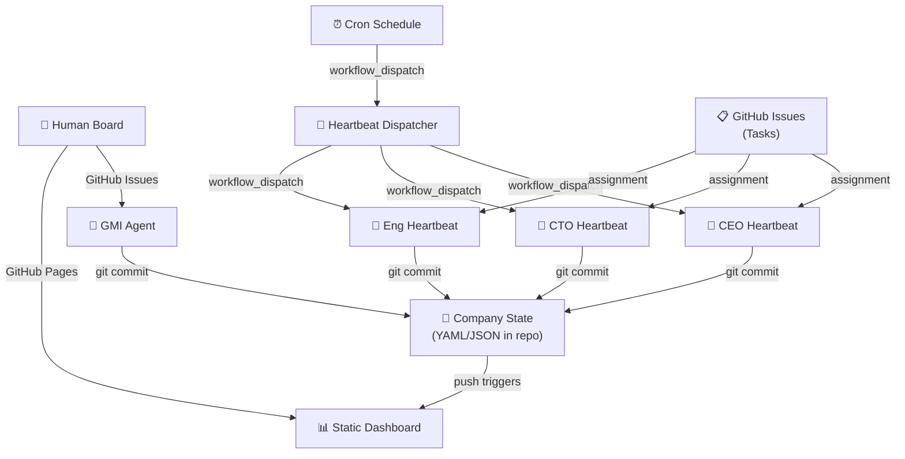

# Githubification Analysis — Paperclip

### How this repository can become a GitHub Action–based mechanism

---

## Executive Summary

**Paperclip** is an open-source control plane for autonomous AI companies — a Node.js server and React UI that orchestrates teams of AI agents with org charts, budgets, governance, task management, and heartbeat scheduling. It is a **Type 2 — Non-AI Software Repo** under the Githubification taxonomy, but with a unique twist: the software it orchestrates _is itself AI agents_. Githubifying Paperclip means turning a control plane for agents into a control plane that _runs on_ the same GitHub infrastructure those agents already use.

This analysis maps every Paperclip capability to its GitHub-native equivalent, identifies what maps cleanly and what requires architectural compromise, outlines three possible strategies, and provides a phased implementation roadmap.

---

## Table of Contents

1. [What Paperclip Does Today](#1-what-paperclip-does-today)
2. [Githubification Classification](#2-githubification-classification)
3. [The Four-Primitive Mapping](#3-the-four-primitive-mapping)
4. [Strategy Recommendation](#4-strategy-recommendation)
5. [Capability-by-Capability Migration Map](#5-capability-by-capability-migration-map)
6. [AI Agent Integration](#6-ai-agent-integration)
7. [Moving the Web UI to GitHub Pages](#7-moving-the-web-ui-to-github-pages)
8. [Replacing the Server with GitHub Actions](#8-replacing-the-server-with-github-actions)
9. [State Management Without a Database](#9-state-management-without-a-database)
10. [The Heartbeat Problem](#10-the-heartbeat-problem)
11. [The Meta-Orchestration Question](#11-the-meta-orchestration-question)
12. [Implementation Roadmap](#12-implementation-roadmap)
13. [Architecture Diagrams](#13-architecture-diagrams)
14. [Risk Assessment](#14-risk-assessment)
15. [What GMI Teaches Paperclip](#15-what-gmi-teaches-paperclip)

---

## 1. What Paperclip Does Today

Paperclip is a self-hosted control plane where a human board operator creates companies, hires AI agents, defines org structures, assigns tasks, sets budgets, and monitors autonomous execution. It coordinates agents the way a corporate operating system coordinates employees.

### Core Capabilities

| Capability | Implementation |
|---|---|
| **Company management** | Create/list/update/archive companies, each with a goal, org chart, and budget |
| **Agent orchestration** | 7+ adapter types (Claude, Codex, Cursor, Gemini, OpenCode, Pi, OpenClaw Gateway) |
| **Org charts** | Strict tree hierarchy with `reports_to` relationships |
| **Task management** | Hierarchical tasks with parent/child chains, atomic checkout, single assignee |
| **Heartbeat scheduling** | Timer-based, assignment-based, and on-demand agent invocations |
| **Cost tracking** | Token/model usage ingestion, rollups by agent/task/project/company |
| **Budget enforcement** | Monthly UTC budgets with soft alerts and hard-stop auto-pause |
| **Governance** | Board approvals for hires and strategy, pause/terminate any agent |
| **Activity logging** | Immutable audit log for all mutating actions |
| **Session persistence** | Agent runtime state, session IDs, and task-scoped sessions |
| **Skills system** | Runtime skill injection for agents without retraining |
| **Company templates** | Export/import full org structures with secret scrubbing |
| **Webhook ingestion** | Plugin-based webhook endpoints for GitHub, Linear, Stripe |
| **REST API** | Full CRUD for all entities, agent-facing API with JWT auth |
| **React UI** | Dashboard, org chart, task board, agent detail, cost views, approval queues |

### Current Architecture

```
┌─────────────────────────────────────────────────────────────┐
│                     React UI (Vite)                          │
│  Dashboard · Org Chart · Tasks · Agents · Costs · Approvals │
└──────────────┬──────────────────────────┬───────────────────┘
               │ REST API                 │ (served by API server)
               ▼                          ▼
┌─────────────────────────────────────────────────────────────┐
│                   Paperclip Server (Express)                 │
│  ┌──────────┐ ┌───────────┐ ┌────────────┐ ┌────────────┐  │
│  │ Heartbeat│ │   Routes  │ │    Auth    │ │  Plugins   │  │
│  │ Service  │ │  (18+)    │ │  (JWT/Key) │ │  (Webhook) │  │
│  └────┬─────┘ └───────────┘ └────────────┘ └────────────┘  │
│       │                                                      │
│  ┌────▼──────┐ ┌───────────┐ ┌────────────┐                │
│  │  Adapters │ │ Services  │ │  Storage   │                │
│  │ (7 types) │ │  (40+)    │ │ (PGlite/PG)│                │
│  └───────────┘ └───────────┘ └────────────┘                │
└─────────────────────────────────────────────────────────────┘
               │
               ▼
┌─────────────────────────────────────────────────────────────┐
│              External Agents (Process / HTTP)                │
│  Claude Code · Codex · Cursor · OpenClaw · Pi · Custom      │
└─────────────────────────────────────────────────────────────┘
```

### Key Dependencies

- **Runtime**: Node.js 20+, pnpm 9.15+
- **Database**: PostgreSQL (or embedded PGlite for dev)
- **Packages**: 8 internal packages (db, shared, adapters, adapter-utils, plugins)
- **Frontend**: React + Vite
- **ORM**: Drizzle
- **Agent runtimes**: External processes or HTTP endpoints

---

## 2. Githubification Classification

### Type 2 — Non-AI Software Repo (with Meta-Orchestration Properties)

Paperclip is **not itself an AI agent** — it is infrastructure that orchestrates AI agents. Under the Githubification taxonomy:

> **Type 2**: The repository contains software that is *not* an AI agent. Githubification inserts an AI agent into the repo that provides two capabilities:
> 1. **AI-powered access** — interact with the software's functionality through the AI agent.
> 2. **GitHub-as-infrastructure execution** — run the software itself on GitHub Actions without local installation.

However, Paperclip occupies a unique position: it is a **control plane for agents**. This creates a meta-orchestration question that doesn't arise in simpler Type 2 cases (like Cronicle). When you Githubify a task scheduler, you're replacing cron with `schedule:` triggers. When you Githubify Paperclip, you're replacing _an agent orchestrator_ with GitHub Actions — but the orchestrator's job is to _run agents_, and those agents may themselves already be Githubified (GMI, GitClaw, OpenClaw).

This makes Paperclip the most architecturally complex Githubification candidate in the portfolio: **the orchestrator and the things it orchestrates share the same target runtime**.

### Why Not Substitution?

Despite its complexity, Paperclip should not be treated as a Substitution candidate (Strategy 3). Its core capabilities — scheduling, task assignment, budget tracking, org hierarchy — all have direct or near-direct GitHub primitive equivalents. The challenge is not "this can't run on Actions" but "this requires coordinated use of multiple Actions primitives simultaneously."

---

## 3. The Four-Primitive Mapping

The Githubification invariant — four GitHub primitives serving four roles — maps to Paperclip as follows:

| GitHub Primitive | Role | Paperclip Equivalent | Migration Path |
|---|---|---|---|
| **GitHub Actions** | Compute | Express server, heartbeat service, adapter execution, budget enforcement | `schedule:` triggers replace heartbeat timers; `workflow_dispatch` replaces on-demand invocations; composite actions replace adapter execution; matrix jobs replace multi-agent scheduling |
| **Git** | Storage and memory | PostgreSQL database (companies, agents, tasks, costs, sessions, activity) | JSON/YAML files committed to the repo replace database tables; company state stored as directory trees; session history as JSONL |
| **GitHub Issues** | User interface | React UI (dashboard, org chart, tasks, costs, approvals) | Issues become the conversational interface for company management; labels encode status/priority/type; milestones encode goals; project boards encode org structure |
| **GitHub Secrets** | Credential store | Agent API keys, JWT secrets, LLM API keys, adapter configs | Repository secrets for LLM keys; environment secrets for agent credentials; encrypted JSON for company-scoped secrets |

---

## 4. Strategy Recommendation

### Primary Strategy: Hybrid (AI Agent Insertion + Partial Feature Replacement)

Three strategies are viable for Paperclip, each at a different point on the fidelity–simplicity spectrum:

### Strategy A — Full Replacement (Maximum Githubification)

Replace the entire Paperclip server with GitHub-native primitives:

| Component | Replacement |
|---|---|
| Database | Git-committed JSON/YAML state files |
| Heartbeat scheduler | `schedule:` cron triggers on workflows |
| Task management | GitHub Issues with structured labels |
| Org chart | Directory structure or YAML config |
| Budget tracking | JSON ledger files, committed on each cost event |
| Dashboard | GitHub Pages static site, rebuilt on push |
| Agent execution | `workflow_dispatch` triggers on agent-specific workflows |
| Approvals | Issue-based approval gates with required labels |

**Pros**: True zero-infrastructure. The repo IS the company. Maximum alignment with Githubification philosophy.
**Cons**: Loses the rich React UI. Budget enforcement becomes eventually consistent. Real-time monitoring is impossible. Multi-company isolation requires separate repositories.

### Strategy B — AI Agent Gateway (Recommended)

Insert a GitHub Minimum Intelligence agent into the repo that provides conversational access to Paperclip's full API. The agent acts as a bridge between GitHub Issues and the Paperclip REST API:

| Interaction | How It Works |
|---|---|
| "Create a new company called TechCorp" | Agent calls `POST /api/companies` |
| "Hire a CTO who reports to the CEO" | Agent calls `POST /api/agents` with `reportsTo` |
| "What's the total spend this month?" | Agent calls `GET /api/costs/rollup` |
| "Approve the pending hires" | Agent calls `POST /api/approvals/:id/approve` |
| "Pause the marketing agent" | Agent calls `PATCH /api/agents/:id` with status change |

The GMI agent folder (`.github-minimum-intelligence/`) sits alongside the Paperclip codebase. The agent has skills that understand the Paperclip API and can operate the control plane through natural language commands in GitHub Issues.

**Pros**: Full Paperclip functionality preserved. Conversational interface is additive. Paperclip server can run anywhere. Simplest implementation.
**Cons**: Requires the Paperclip server to be running somewhere (not fully Githubified). The agent is a client, not a replacement.

### Strategy C — Serverless Control Plane (Progressive Githubification)

Progressively migrate Paperclip's server functionality into GitHub Actions workflows while keeping the data model intact:

| Phase | What Migrates |
|---|---|
| Phase 1 | Heartbeat scheduling → `schedule:` workflows that call agent adapters |
| Phase 2 | Task lifecycle → Issue-driven with structured metadata in issue bodies |
| Phase 3 | Budget enforcement → Pre-execution workflow step that checks committed ledger |
| Phase 4 | Activity log → Git commit history with structured commit messages |
| Phase 5 | Company state → YAML/JSON files in `companies/<slug>/` directories |
| Phase 6 | Dashboard → GitHub Pages static site rebuilt on state changes |

**Pros**: Incremental migration. Each phase delivers standalone value. Eventually reaches full Githubification.
**Cons**: Long implementation timeline. Transitional states are complex. Some features degrade during migration.

### Recommendation

**Start with Strategy B** (AI Agent Gateway) for immediate value with minimal disruption. This proves the concept and provides a GitHub-native interface to Paperclip immediately.

**Progress to Strategy C** (Serverless Control Plane) for teams that want to eliminate the server dependency entirely.

**Strategy A** (Full Replacement) is the theoretical end state — a company defined entirely as files in a repository, with GitHub Actions as the execution engine. It should be the north star, not the first step.

---

## 5. Capability-by-Capability Migration Map

### What Maps Cleanly ✅

| Paperclip Feature | GitHub Primitive | Notes |
|---|---|---|
| Heartbeat timers | `on: schedule: - cron:` | Direct replacement. Per-agent workflows with cron expressions. |
| On-demand agent invocation | `on: workflow_dispatch:` | Manual trigger with agent ID as input parameter. |
| Task assignment triggers | `on: issues: types: [assigned]` | Issue assignment triggers agent workflow. |
| Activity log | Git commit history | Every state mutation is a commit. `git log` IS the audit trail. |
| Agent API keys | GitHub Secrets | Per-repository or per-environment secrets. |
| Cost ledger | JSON file committed to repo | Append-only cost events, rolled up on read. |
| Company configuration | YAML files in `companies/` | Org chart, goals, budgets as declarative config. |
| Session persistence | JSONL files in `state/` | Same pattern as GMI — sessions committed to git. |
| Approval gates | GitHub Issues with required labels | "Pending approval" label → human adds "Approved" → workflow proceeds. |
| Skills injection | Markdown files in `.pi/skills/` | Same pattern as GMI — skills as documents. |
| Company templates | Repository template feature | GitHub's native template repository system. |

### What Maps With Effort ⚠️

| Paperclip Feature | GitHub Approach | Gap |
|---|---|---|
| Multi-company isolation | Separate repositories or directory-based scoping | GitHub has no native "company within a repo" concept. Separate repos provide true isolation but lose single-pane-of-glass. |
| Org chart visualization | GitHub Pages static site or Mermaid in README | No interactive drag-and-drop. Mermaid diagrams are auto-generated from YAML. |
| Budget hard-stop | Pre-execution workflow step | Eventually consistent — the check runs before the agent starts, not during. |
| Real-time dashboard | GitHub Pages + polling or webhook-triggered rebuilds | No WebSocket push. Dashboard is a static snapshot rebuilt on each state change. |
| Task hierarchy | Issue parent/child (sub-issues) or linked issues | GitHub Issues support sub-issues natively, but the UX is not as rich as Paperclip's. |
| Atomic task checkout | Workflow concurrency groups | `concurrency: task-<id>` with `cancel-in-progress: false` provides mutual exclusion. |
| Agent adapter system | Workflow templates per adapter type | Each adapter becomes a reusable workflow. Agent config determines which workflow runs. |

### What Doesn't Map ❌

| Paperclip Feature | Why It's Hard | Workaround |
|---|---|---|
| Embedded PostgreSQL | GitHub Actions runners are ephemeral | Git-committed JSON/YAML state files (see §9). |
| 40+ REST API routes | No persistent HTTP server | Issue commands → GMI agent → state file mutations. |
| React UI (dashboard, org chart, detail views) | No dynamic server-rendered content | GitHub Pages static site rebuilt on push (see §7). |
| Real-time heartbeat monitoring | Actions don't push status to external consumers | Polling via GitHub API, or webhook notifications on workflow completion. |
| Plugin system (webhook ingestion) | Ephemeral runners can't listen for incoming requests | GitHub webhook events trigger workflows directly — no intermediary needed. |
| Session compaction | Server-side session management for long conversations | Client-side compaction in the agent lifecycle script, same as GMI. |

---

## 6. AI Agent Integration

### The GMI Bridge

The most natural first step is inserting a [GitHub Minimum Intelligence](https://github.com/japer-technology/github-minimum-intelligence) agent into the Paperclip repository. This agent provides conversational access to Paperclip's capabilities through GitHub Issues.

### Required Skills

The GMI agent would need Paperclip-specific skills in `.github-minimum-intelligence/.pi/skills/`:

| Skill | Purpose |
|---|---|
| `paperclip-company` | Create, list, configure, and archive companies |
| `paperclip-agents` | Hire agents, configure adapters, set reporting lines |
| `paperclip-tasks` | Create tasks, assign work, track status, manage hierarchy |
| `paperclip-budget` | Set budgets, review spend, enforce limits |
| `paperclip-governance` | Approve/reject pending actions, pause agents, intervene |
| `paperclip-dashboard` | Generate summary reports of company status, costs, and activity |

### Interaction Model

```
User opens Issue: "Create a startup called NoteGenius with the goal 
                   of building the #1 AI note-taking app to $1M MRR"

GMI Agent:
  1. Reads the issue
  2. Activates `paperclip-company` skill
  3. Creates company configuration in companies/notegenius/company.yaml
  4. Proposes initial org structure (CEO, CTO, CMO)
  5. Commits state to git
  6. Replies with summary and asks for approval to proceed

User comments: "Approved. Hire the team."

GMI Agent:
  1. Loads session (full context of prior exchange)
  2. Creates agent configs in companies/notegenius/agents/
  3. Sets up heartbeat workflows
  4. Commits state
  5. Replies with org chart and next steps
```

### AGENTS.md Configuration

The Paperclip GMI agent's identity would be configured in `.github-minimum-intelligence/AGENTS.md`:

```markdown
# Paperclip Control Agent

You are the board interface for a Paperclip autonomous company deployment.
You manage companies, agents, org structures, tasks, budgets, and approvals
through conversational commands in GitHub Issues.

You have access to company state stored in this repository under `companies/`.
Every change you make is committed to git, providing full audit history.

When asked to create or modify company structures, you operate on YAML/JSON
configuration files. When asked about status, you read the committed state
and generate reports.
```

---

## 7. Moving the Web UI to GitHub Pages

### Current State

Paperclip's React UI is a rich SPA with:
- Dashboard with company overview, agent status, cost summaries
- Interactive org chart with drag-and-drop
- Task board with kanban-style views
- Agent detail pages with heartbeat history
- Cost breakdown visualizations
- Approval queue
- Settings and configuration panels

### GitHub Pages Strategy: Static Reporting Dashboard

The Paperclip UI cannot run as-is on GitHub Pages — it requires the Express server for API calls. A Githubified version would be a **static reporting dashboard** rebuilt on every state change:

```
on:
  push:
    paths:
      - 'companies/**'
      - 'state/**'

jobs:
  rebuild-dashboard:
    runs-on: ubuntu-latest
    steps:
      - uses: actions/checkout@v6
      - run: node scripts/generate-dashboard.js
      - uses: actions/upload-pages-artifact@v4
        with:
          path: public/
      - uses: actions/deploy-pages@v4
```

### Dashboard Content (generated from committed state)

| Page | Data Source | Format |
|---|---|---|
| Company overview | `companies/*/company.yaml` | Summary table with goals, status, agent counts |
| Org chart | `companies/*/agents/*.yaml` | Mermaid diagram auto-generated from `reportsTo` fields |
| Task board | `companies/*/tasks/*.yaml` | Status-grouped task lists with assignees |
| Cost summary | `companies/*/costs/ledger.jsonl` | Chart.js visualizations from committed cost events |
| Activity feed | `git log --format` | Recent commits formatted as activity entries |
| Agent status | `companies/*/agents/*.yaml` + workflow run status | Current status from last heartbeat run |

---

## 8. Replacing the Server with GitHub Actions

### Heartbeat Scheduling (the core loop)

Paperclip's heartbeat service is the engine that drives autonomous agent execution. In a Githubified world, each agent has its own workflow file:

```yaml
# .github/workflows/heartbeat-ceo.yml
name: Heartbeat — CEO Agent

on:
  schedule:
    - cron: '0 */4 * * *'  # Every 4 hours
  workflow_dispatch:
    inputs:
      reason:
        description: 'Invocation reason'
        default: 'manual'

jobs:
  heartbeat:
    runs-on: ubuntu-latest
    steps:
      - uses: actions/checkout@v6
      
      - name: Check budget
        run: |
          SPENT=$(jq '.total' companies/acme/costs/current-month.json)
          LIMIT=$(yq '.budget.monthly' companies/acme/agents/ceo.yaml)
          if (( $(echo "$SPENT >= $LIMIT" | bc -l) )); then
            echo "::error::Budget exceeded ($SPENT >= $LIMIT)"
            exit 1
          fi
      
      - name: Load agent config
        id: config
        run: |
          echo "adapter=$(yq '.adapter.type' companies/acme/agents/ceo.yaml)" >> "$GITHUB_OUTPUT"
          echo "model=$(yq '.adapter.model' companies/acme/agents/ceo.yaml)" >> "$GITHUB_OUTPUT"
      
      - name: Execute agent
        env:
          OPENAI_API_KEY: ${{ secrets.OPENAI_API_KEY }}
        run: |
          # Load task context, execute adapter, capture results
          node scripts/execute-heartbeat.js \
            --agent ceo \
            --company acme \
            --session-dir companies/acme/state/sessions/
      
      - name: Record costs
        run: |
          # Append usage to cost ledger
          node scripts/record-costs.js \
            --agent ceo \
            --company acme
      
      - name: Commit state
        run: |
          git add -A
          git diff --cached --quiet || {
            git commit -m "heartbeat: ceo @ $(date -u +%Y-%m-%dT%H:%M:%SZ)"
            git push
          }
```

### Task Lifecycle via Issues

```yaml
# .github/workflows/task-assigned.yml
name: Task Assignment Handler

on:
  issues:
    types: [assigned]

jobs:
  process-assignment:
    runs-on: ubuntu-latest
    if: contains(github.event.issue.labels.*.name, 'task')
    steps:
      - uses: actions/checkout@v6
      
      - name: Extract task metadata
        id: task
        run: |
          # Parse structured metadata from issue body
          AGENT=$(echo "${{ github.event.issue.assignee.login }}")
          COMPANY=$(echo "${{ github.event.issue.labels }}" | jq -r '.[] | select(.name | startswith("company:")) | .name | sub("company:"; "")')
          echo "agent=$AGENT" >> "$GITHUB_OUTPUT"
          echo "company=$COMPANY" >> "$GITHUB_OUTPUT"
      
      - name: Update task state
        run: |
          # Mark task as in_progress in committed state
          node scripts/update-task-state.js \
            --issue "${{ github.event.issue.number }}" \
            --status in_progress \
            --agent "${{ steps.task.outputs.agent }}"
      
      - name: Trigger agent heartbeat
        uses: actions/github-script@v7
        with:
          script: |
            await github.rest.actions.createWorkflowDispatch({
              owner: context.repo.owner,
              repo: context.repo.repo,
              workflow_id: `heartbeat-${steps.task.outputs.agent}.yml`,
              ref: 'main',
              inputs: { reason: 'task-assignment' }
            })
```

### Approval Gates

```yaml
# .github/workflows/approval-gate.yml  
name: Approval Gate

on:
  issues:
    types: [labeled]

jobs:
  process-approval:
    runs-on: ubuntu-latest
    if: github.event.label.name == 'approved'
    steps:
      - uses: actions/checkout@v6
      
      - name: Process approved action
        run: |
          # Read the pending approval from the issue body
          # Execute the approved action (hire agent, approve strategy, etc.)
          node scripts/process-approval.js \
            --issue "${{ github.event.issue.number }}"
      
      - name: Commit and notify
        run: |
          git add -A
          git diff --cached --quiet || {
            git commit -m "approval: processed #${{ github.event.issue.number }}"
            git push
          }
```

---

## 9. State Management Without a Database

### The Core Challenge

Paperclip uses PostgreSQL (or embedded PGlite) with 20+ tables via Drizzle ORM. A Githubified version must store the same data in files committed to git.

### Proposed State Structure

```
companies/
  acme/
    company.yaml              # Name, goal, status, created_at
    org-chart.yaml             # Agent hierarchy (reports_to tree)
    budget.yaml                # Monthly limits per agent
    agents/
      ceo.yaml                 # Config, adapter, role, status
      cto.yaml
      eng-1.yaml
    tasks/
      001-define-strategy.yaml # Status, assignee, parent, priority
      002-build-mvp.yaml
    goals/
      mission.yaml             # Top-level company goal
      q1-revenue.yaml          # Sub-goals
    costs/
      2026-03.jsonl            # Append-only cost events for March 2026
      current-month.json       # Rolled-up summary (rebuilt on each append)
    state/
      sessions/                # Agent session transcripts (JSONL)
      activity.jsonl           # Audit log (append-only)

.github-minimum-intelligence/   # GMI agent for conversational interface
  .pi/
    skills/
      paperclip-company/
      paperclip-agents/
      paperclip-tasks/
      paperclip-budget/
      paperclip-governance/
  state/
    issues/                    # Issue → session mappings
    sessions/                  # GMI conversation transcripts
```

### Database Table → File Mapping

| Drizzle Table | File Format | Location |
|---|---|---|
| `companies` | YAML | `companies/<slug>/company.yaml` |
| `agents` | YAML | `companies/<slug>/agents/<name>.yaml` |
| `issues` (tasks) | YAML or GitHub Issues | `companies/<slug>/tasks/<id>.yaml` or GitHub Issues with labels |
| `goals` | YAML | `companies/<slug>/goals/<slug>.yaml` |
| `costEvents` | JSONL (append-only) | `companies/<slug>/costs/<YYYY-MM>.jsonl` |
| `heartbeatRuns` | JSONL (append-only) | `companies/<slug>/state/heartbeat-runs.jsonl` |
| `activityLog` | JSONL (append-only) | `companies/<slug>/state/activity.jsonl` |
| `agentApiKeys` | GitHub Secrets | Repository or environment secrets |
| `agentRuntimeState` | JSON | `companies/<slug>/state/sessions/<agent>-runtime.json` |
| `approvals` | GitHub Issues with labels | Issues labeled `approval-pending` / `approved` / `rejected` |

### Concurrency and Consistency

The same challenge as every Githubified repo: concurrent workflow runs may conflict on git push. The solution is the same:

1. **Per-company concurrency groups**: `company-acme-${{ github.event.issue.number }}`
2. **Git push retry loop**: 10 attempts with `git pull --rebase -X theirs`
3. **Append-only formats**: JSONL files are safe for concurrent appends after rebase
4. **YAML files**: Per-agent/per-task files minimize merge conflicts

---

## 10. The Heartbeat Problem

Paperclip's heartbeat service is its most sophisticated component — 3,800+ lines of TypeScript handling wakeup queues, timer-based scheduling, session persistence, run tracking, cancellation, and result processing. Replacing this with GitHub Actions is the largest architectural lift.

### What GitHub Actions Provides

| Capability | GitHub Actions Support |
|---|---|
| Cron scheduling | ✅ `on: schedule:` — but minimum granularity is 5 minutes, and timing is approximate |
| Manual trigger | ✅ `on: workflow_dispatch:` — with input parameters |
| Event-driven trigger | ✅ `on: issues:`, `on: issue_comment:`, `on: push:` |
| Concurrency control | ✅ `concurrency:` groups with `cancel-in-progress` option |
| Run timeout | ✅ `timeout-minutes:` per job |
| Run cancellation | ✅ Via GitHub API `POST /repos/{owner}/{repo}/actions/runs/{run_id}/cancel` |
| Run status tracking | ✅ Workflow run status is queryable via API |
| Matrix execution | ✅ `strategy: matrix:` for parallel multi-agent execution |

### What GitHub Actions Lacks

| Capability | Gap |
|---|---|
| Sub-minute scheduling | Actions minimum is ~5 minutes; Paperclip heartbeats can be seconds |
| Dynamic scheduling | Cron expressions are static in YAML; can't change interval at runtime |
| Wakeup queue | No native queue — must use `workflow_dispatch` chains or repository dispatch |
| Session resumption | Must be implemented in the lifecycle script (commit/load session files) |
| Budget-aware scheduling | Pre-execution check step (eventually consistent, not real-time) |
| Run-level cost tracking | Must capture from adapter output and commit to cost ledger |

### Proposed Heartbeat Architecture

```
┌──────────────────────────────────────────────────┐
│               Heartbeat Dispatcher                │
│          (scheduled workflow, every 5 min)         │
│                                                    │
│  1. Read companies/*/agents/*.yaml                 │
│  2. For each agent with due heartbeat:             │
│     a. Check budget (read cost ledger)             │
│     b. Check task queue (read task files)           │
│     c. Trigger workflow_dispatch for agent          │
│  3. Commit updated schedule state                  │
└──────────────────┬───────────────────────────────┘
                   │ workflow_dispatch
                   ▼
┌──────────────────────────────────────────────────┐
│            Agent Heartbeat Workflow                │
│          (per-agent, triggered by dispatcher)      │
│                                                    │
│  1. Checkout repo                                  │
│  2. Load agent config + session state              │
│  3. Check budget (pre-execution guard)             │
│  4. Execute adapter (claude/codex/pi/etc.)         │
│  5. Capture results + usage                        │
│  6. Append cost events to ledger                   │
│  7. Update task status if applicable               │
│  8. Commit session state + cost events             │
│  9. Push with retry                                │
└──────────────────────────────────────────────────┘
```

---

## 11. The Meta-Orchestration Question

Paperclip's unique position creates a philosophical question: **should the orchestrator be Githubified, or should it be eliminated?**

### The Argument for Elimination

If every agent in a Paperclip company is already Githubified (runs on Actions, converses through Issues, persists through Git), then Paperclip's core value proposition — "orchestrate agents that phone home" — is already handled by GitHub itself:

| Paperclip Provides | GitHub Already Has |
|---|---|
| Agent scheduling | `schedule:` triggers |
| Task assignment | Issue assignment |
| Agent monitoring | Workflow run status |
| Cost visibility | Usage API + committed ledgers |
| Audit trail | Git commit history |
| Governance | Branch protection, required reviews, CODEOWNERS |
| Org structure | Repository teams, CODEOWNERS |

In this view, a fully Githubified world doesn't need Paperclip — it needs a **repository template** that sets up the right workflow files, issue templates, and state directories for a company.

### The Argument for Transformation

GitHub's primitives are low-level. They provide the building blocks but not the abstractions:

| What's Missing | Why It Matters |
|---|---|
| Goal hierarchy | GitHub Issues are flat. Paperclip's "every task traces to the company goal" requires structured metadata. |
| Budget enforcement | GitHub has no concept of token budgets or cost limits. This must be built. |
| Org chart intelligence | GitHub teams are for access control, not reporting hierarchies. An org-aware dispatcher is needed. |
| Cross-agent coordination | GitHub doesn't know that the CTO should review the engineer's work. Delegation logic is custom. |
| Company-as-unit | GitHub repositories are the unit. "Multiple companies in one repo" requires explicit state partitioning. |

**The transformed Paperclip is not a server — it's a set of workflows, scripts, and state conventions that turn a GitHub repository into a company.**

---

## 12. Implementation Roadmap

### Phase 1 — GMI Agent Gateway (Weeks 1–2)

Install GitHub Minimum Intelligence into the Paperclip repository. Create skills that can read and report on the Paperclip codebase. This provides immediate conversational access via GitHub Issues without changing any existing functionality.

| Deliverable | Description |
|---|---|
| `.github-minimum-intelligence/` folder | Standard GMI installation |
| `paperclip-overview` skill | Reads and summarizes company configs, agent status, task state |
| Workflow file | `github-minimum-intelligence-agent.yml` |
| Issue templates | Chat and task templates |

### Phase 2 — State-as-Files (Weeks 3–4)

Define the file-based state format for companies, agents, tasks, goals, costs, and sessions. Build scripts that can read/write this state. This is the foundation for all subsequent phases.

| Deliverable | Description |
|---|---|
| `companies/` directory structure | YAML configs for company, agents, goals, budgets |
| State management scripts | `scripts/read-state.js`, `scripts/write-state.js` |
| Cost ledger format | JSONL append-only with monthly rollup |
| Migration script | Convert existing PGlite data to file-based state |

### Phase 3 — Heartbeat Workflows (Weeks 5–6)

Replace the heartbeat service with GitHub Actions workflows. A dispatcher workflow runs on schedule, checks which agents need invocation, and triggers per-agent workflows.

| Deliverable | Description |
|---|---|
| `heartbeat-dispatcher.yml` | Scheduled workflow that reads agent configs and dispatches |
| `heartbeat-agent.yml` | Reusable workflow that executes a specific agent |
| Budget guard step | Pre-execution check against committed cost ledger |
| Session management | Load/save session state from git |

### Phase 4 — Issue-Driven Tasks (Weeks 7–8)

Map Paperclip's task lifecycle to GitHub Issues. Task creation, assignment, status transitions, and comments all happen through Issues.

| Deliverable | Description |
|---|---|
| Issue templates | Structured task templates with YAML front matter |
| Label schema | `company:*`, `status:*`, `priority:*`, `agent:*`, `type:task`, `type:approval` |
| Task lifecycle workflows | Handlers for `issues: [opened, assigned, labeled, closed]` |
| Approval gate workflow | Label-based approval processing |

### Phase 5 — Static Dashboard (Weeks 9–10)

Build a GitHub Pages dashboard that reads committed state files and generates a static site showing company status, org charts, task boards, and cost summaries.

| Deliverable | Description |
|---|---|
| Dashboard generator script | Reads `companies/` tree, outputs static HTML |
| Mermaid org chart | Auto-generated from agent YAML configs |
| Cost visualizations | Chart.js charts from cost ledger data |
| Rebuild workflow | Triggers on push to `companies/**` |

### Phase 6 — Multi-Company Templates (Weeks 11–12)

Create GitHub repository templates that set up a complete company from scratch. Support company import/export using the existing Paperclip company template format.

| Deliverable | Description |
|---|---|
| Repository template | Pre-configured workflows, scripts, and state directories |
| Company import script | Converts Paperclip company export to file-based state |
| `onboard` workflow | Guided company setup via `workflow_dispatch` with inputs |

---

## 13. Architecture Diagrams

### Current Architecture (Server-Based)



### Githubified Architecture (Actions-Based)



---

## 14. Risk Assessment

### High Risk ⛔

| Risk | Impact | Mitigation |
|---|---|---|
| **GitHub Actions rate limits** | Multi-agent companies with frequent heartbeats may hit workflow dispatch limits (1,000 API requests/hour) | Batch dispatches; use matrix jobs for parallel agents; reduce heartbeat frequency |
| **Git merge conflicts** | Concurrent agent commits to the same repository | Per-company concurrency groups; append-only formats; per-agent state directories |
| **Schedule imprecision** | `schedule:` triggers can be delayed by minutes during high-demand periods | Accept eventual consistency; use `workflow_dispatch` for time-sensitive operations |
| **State size growth** | JSONL ledgers and session files grow indefinitely | Monthly rotation; archival workflows that compress old state |

### Medium Risk ⚠️

| Risk | Impact | Mitigation |
|---|---|---|
| **No real-time monitoring** | Board cannot see agent activity in real time | Webhook notifications on workflow completion; periodic dashboard rebuilds |
| **Budget enforcement lag** | Cost check happens before agent runs, not during | Acceptable for most use cases; add mid-run checkpoints for long-running agents |
| **Multi-company complexity** | Multiple companies in one repo create label/path conflicts | Use separate repositories per company (cleanest isolation) |
| **Workflow file proliferation** | Each agent adds a workflow file | Use reusable workflows with per-agent config inputs |

### Low Risk ✅

| Risk | Impact | Mitigation |
|---|---|---|
| **Loss of React UI** | Less interactive experience | GitHub Pages dashboard covers 80% of use cases; Issues cover the rest |
| **Adapter compatibility** | Not all Paperclip adapters translate to Actions | Start with process-based adapters (Claude, Pi); add others incrementally |
| **Session management** | More complex without a persistent server | Same pattern as GMI — solved problem, battle-tested across 6+ Githubified repos |

---

## 15. What GMI Teaches Paperclip

The [GitHub Minimum Intelligence](https://github.com/japer-technology/github-minimum-intelligence) project provides a proven blueprint for every technical challenge Paperclip's Githubification will face:

| Challenge | GMI's Proven Solution |
|---|---|
| Agent execution on Actions | Single workflow file with guard → indicate → execute → commit pipeline |
| Session persistence | JSONL files committed to git, loaded by session ID |
| Issue-driven conversation | `Issue #N → state/issues/N.json → state/sessions/<session>.jsonl` |
| Authorization | Workflow-level permission check via `gh api` |
| Concurrency | Per-issue concurrency groups + 10-attempt push retry with rebase |
| Agent identity | `AGENTS.md` + hatching protocol |
| Extensibility | `.pi/skills/` Markdown modules |
| Multi-provider LLM | `settings.json` with 8+ providers |
| Self-installation | Workflow-based installer with version checking |
| Documentation as architecture | Foundational questions, DEFCON levels, Four Laws |

**The lesson is clear**: every pattern Paperclip needs for Githubification has already been proven in GMI. The challenge is not inventing new patterns — it's composing existing ones at the scale of a multi-agent control plane.

---

## Summary

Paperclip's Githubification is the most architecturally ambitious case in the portfolio. It is not merely adding an AI agent to a repo (Type 2 standard) or wrapping an existing agent (Type 1 wrapping). It is the Githubification of an **orchestrator** — a system whose purpose is to coordinate other agents.

The recommended approach is progressive:

1. **Immediate**: Install GMI as a conversational gateway (Strategy B)
2. **Short-term**: Define file-based state format and build heartbeat workflows (Strategy C, Phases 1–3)
3. **Medium-term**: Migrate task lifecycle to Issues and build static dashboard (Strategy C, Phases 4–5)
4. **Long-term**: Publish repository templates for one-click company creation (Strategy C, Phase 6)

The end state is a repository that IS a company — where GitHub Actions is the heartbeat, Git is the memory, Issues are the task board, and the human board operates through a GMI agent that speaks the language of business, not pull requests.

**Paperclip's Githubification thesis**: _The control plane for autonomous companies should itself be autonomous — running on the same infrastructure as the companies it creates._

---

*Analysis applied to [githubification-paperclip](https://github.com/japer-technology/githubification-paperclip), referencing patterns from [GitHub Minimum Intelligence](https://github.com/japer-technology/github-minimum-intelligence) v1.0.8 and [Githubification](https://github.com/japer-technology/githubification).*
