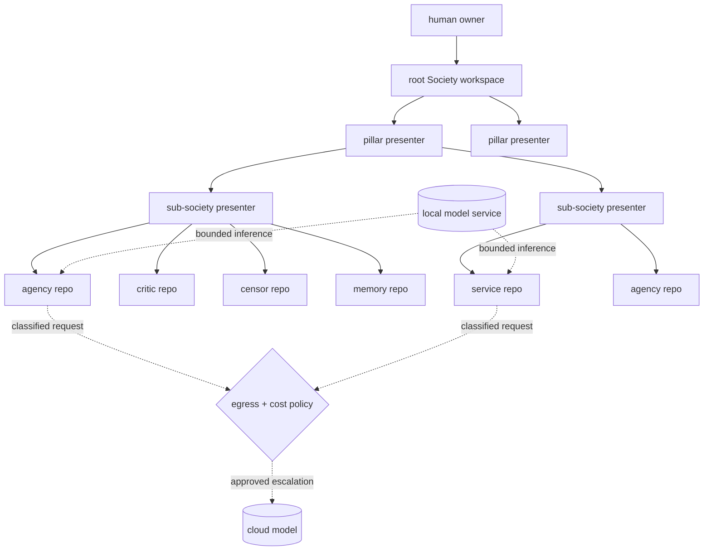

# The Forge at 100,000 Repositories

> Ubuntu Zombie, custom intelligence, and the operational shape of Forgejo
> Society

## Abstract

Forgejo Society is an attempt to make cognition durable, governed, and locally
owned by rebuilding it from forge primitives. Repositories hold bounded roles.
Issues and webhooks provide stimuli. Workflows and runners execute. Branches
hold candidate futures. Pull requests carry proposed actions. Critics object;
censors block; settlements record judgment; commits preserve memory. Language
models contribute classification, generation, comparison, and synthesis, but no
model is the Society and model capability does not confer authority.

The long design horizon is a federation of perhaps 100,000 repositories, each
with custom Intelligence and each able to participate in larger Minds. That
number should not be read as 100,000 simultaneous model processes, nor as one
enormous prompt divided into files. It describes a very large address space of
bounded, mostly dormant cognitive organs that activate selectively, communicate
through governed channels, compress their work through presenters, and leave
recoverable evidence in Git.

[Ubuntu Zombie](https://github.com/japer-technology/ubuntu-zombie) explains why
this project begins below the application layer. It gives an owner a private,
root-capable, policy-gated, audit-logged AI Systems Administrator for an Ubuntu
machine. It was built to overcome a practical constraint: the intended Forgejo
Society runtime depends on owned Ubuntu infrastructure, while its builder did
not begin as an Ubuntu expert. Ubuntu Zombie turns that gap into an operational
learning loop. It is the operator's instrument and precursor, not the Forgejo
Society runtime itself.

This paper examines the resulting project, the meaning of custom intelligence
at repository scale, the architecture implied by 100,000 repositories, and the
engineering proofs still required before that scale can be claimed.

---

## 1. The project is an institutional architecture

The superficial description of Forgejo Society is “many LLM agents on a Git
forge.” That misses the load-bearing idea. The project is designing an
institution in which model calls occur.

A conventional agent system usually begins with a model, gives it tools, adds a
loop, and stores enough state to continue later. Forgejo Society begins with a
different set of questions:

- What is this component for?
- Which authority does it hold: `read`, `draft`, `propose`, `act`, `govern`,
  or `human`?
- Which evidence may it use?
- Which critic must challenge its proposal?
- Which censor can make the proposal impossible?
- Which human approval is required?
- Which durable record will explain what happened?
- How will the outcome change future activation?

Those questions turn an LLM invocation into one event inside a governed
cognitive loop. The project’s five quiet reversals state the result: the forge
is the mind; intelligence is a governed society; capability is granted by files
and audited by Git; cognition persists as Git objects; and sovereignty is a
property of the topology—owned hardware, owned forge, owned files—not a claim
made in prose. See the [project overview](README.md) and the canonical
[Society of Repo specification](FORGEJO-SOCIETY-INTRODUCTION/THE-SOCIETY-OF-REPO/README.md).

This is a systems thesis and a governance thesis at once. The forge supplies
addressing, events, permissions, queues, reviews, history, and execution. The
Society supplies purpose, authority, criticism, censorship, settlement, and
memory discipline. Models supply fallible cognitive capability. Labour executes
bounded work. None of these layers can safely stand in for the others.

The project’s own Mind–Brain–Body distinction is useful here:

| Layer | Forgejo Society meaning | Typical components |
| --- | --- | --- |
| Body | Infrastructure and interfaces | Forgejo, runners, storage, network, APIs, tools |
| Brain | Learned and statistical machinery | local and cloud LLMs, classifiers, retrieval, pattern matching |
| Mind | Governed cognition | constitutions, authority, critics, censors, settlements, memory, self-ideals |

A larger model can improve the Brain layer. It does not amend the constitution,
grant itself a wider token, or satisfy an approval gate. This separation is one
of the project’s strongest ideas because it makes model replacement ordinary.
The Society’s identity can persist while models, providers, quantisations, and
runner hardware change.

---

## 2. Why Ubuntu Zombie came first

Self-hosting is often presented as a deployment preference. Here it is a
dependency of the cognitive design. The production target is a self-hosted
Forgejo on Ubuntu hardware owned by the maintainers. GitHub and shared Forgejo
instances are mirrors, not agent runtimes; they must not receive the runner
fleet, agent secrets, or agent workloads. The boundary is set out in
[WARNING.md](WARNING.md).

That posture creates a plain operational problem. Sovereignty over a runtime is
not obtained merely by purchasing machines. Someone must be able to install,
inspect, repair, secure, update, recover, and eventually reproduce them. If the
owner cannot operate Ubuntu, ownership alone leaves a dependency gap precisely
where the architecture claims independence.

Ubuntu Zombie addresses that gap. Its current public description is concrete:
it adds a private, root-capable AI Systems Administrator account to supported
Ubuntu Desktop LTS machines; the owner can ask the machine to diagnose,
explain, configure, repair, and operate itself; privileged actions pass through
a local policy gate; actions are audit-logged; inbound access is restricted to
a private Tailscale network; and the owner retains the machine, keys, account,
and kill switch. The local Forgejo Society material describes the workstation
as the operator’s hands and explicitly separates it from the production forge
and runner fleet. See the local
[Ubuntu Zombie profile](FORGEJO-SOCIETY-INSTALLATION/ubuntu-zombie/README.md).

Its importance is therefore methodological. Ubuntu Zombie converts systems
administration from an undocumented prerequisite into a supervised practice:

```text
owner intent
  -> proposed system action
  -> policy and approval boundary
  -> privileged execution
  -> verification
  -> audit record
  -> explanation to the owner
```

That sequence anticipates the Society of Repo loop. Both systems treat power as
something that must be bounded, observed, and recoverable. Both use a local
identity, explicit control points, logs, verification, and a kill mechanism.
Both let a person learn by examining proposed and completed work rather than by
having to master every command before beginning.

The analogy has a hard limit. Ubuntu Zombie concentrates root capability in an
operator workstation. Forgejo Society must distribute execution through
restricted runner identities, repository tokens, workflow permissions, and
authority files. A root-capable administrator is appropriate for repairing the
owned body under owner control. It is not an execution identity to copy into
every runner, repository, or agency. Ubuntu Zombie helps the owner build and
repair the city; it is not the citizenship model of the city.

---

## 3. What “custom intelligence” should mean

At 100,000 repositories, custom intelligence cannot sensibly mean a separately
trained large model or a hand-maintained fork of the whole runtime in every
repository. Either interpretation produces prohibitive cost and configuration
drift.

The more useful definition is that a repository’s intelligence is the durable,
reviewable combination of:

- purpose and role;
- authority level and approval requirements;
- enabled Forgejo surfaces;
- Skills and allowed tools;
- critics and censors;
- frames, K-lines, and relevant memory;
- channel and service contracts;
- model-routing and budget policy;
- repo-local state and provenance;
- the pinned runtime version that interprets those files.

The model is part of execution, not the repository’s identity. Two repositories
may call the same local model and remain different cognitive organs because
they have different purposes, memories, authorities, Skills, and constraints.
One repository may move from a local model to an approved cloud model without
becoming a different organ because its governed files and history remain
intact.

This is already visible in the implemented Forgejo Intelligence runtime.
`.forgejo-intelligence/` provides event normalization, guardrails, surface
handlers, an agent entrypoint, a typed Forgejo API adapter, repo-local state,
tests, and a Git-tracked enable sentinel. Capability is partly discovered by
folder presence: adding a supported module enables a surface; removing it
withdraws that capability. Provider and model selection are held in repo-local
settings. See [What Forgejo Intelligence Is](.forgejo-intelligence/WHAT.md) and
the [runtime README](.forgejo-intelligence/README.md).

The 100,000-repository version should preserve that local legibility without
requiring 100,000 independently modified runtime copies. The likely separation
is:

1. a small, shared runtime kernel released immutably and pinned by version or
   digest;
2. repo-local manifests, constitutions, capabilities, policies, memory, and
   state committed in Git;
3. governed rollout records showing which repositories received which kernel
   revision;
4. canary, rollback, and compatibility rules for fleet-wide changes.

The files that grant capability must remain local and reviewable. The executable
kernel that interprets them should be reproducible and common enough to patch.
Without that split, a security fix becomes a 100,000-repository editing event;
with too much centralisation, the local Git record stops telling the truth about
what a repository can do. The design has to hold both requirements.

---

## 4. The unit of scale is dormant addressability

One hundred thousand repositories is first an addressing problem, then an
activation problem, and only then a compute problem.

The wrong mental model is a flat swarm in which every event is broadcast to
every repository. A complete undirected graph of 100,000 repositories would
have 4,999,950,000 pairwise relationships. A directed version would approach
ten billion. No settlement protocol, human briefing layer, or runner fleet
should be asked to absorb that topology.

The repository already points toward the alternative: hierarchical,
heterogeneous, sparse federation. A Mind is a coordinated set of repositories
with one presenter. A member can be a `leaf`, a `presenter`, or `federated`.
The parent talks only to the child society’s presenter; the child decides how
to route work internally. A repository should federate when its responsibilities
need genuinely different authority or censor profiles, not merely because it
has grown large. See [The Federation Mind](FORGEJO-SOCIETY-THE-FEDERATION/minds/README.md).

At the design horizon, the shape is recursive:



Most repositories should be dormant most of the time. Dormancy is not failure;
it is the economic condition that makes the address space possible. A repo
wakes because a relevant Forgejo event arrives, a parent presenter delegates a
bounded request, a scheduled maintenance stimulus fires, or a governed channel
delivers work. Activation should be selective and budgeted. Results should
compress upward. Raw internal traffic should remain inside the smallest society
that can settle it.

The number that governs compute is therefore not repository count. It is:

```text
average concurrent work = event arrival rate x average settlement duration
```

The documented initial fleet proposes sixteen general runner nodes with four
concurrent jobs each, plus a separate GPU inference host: a nominal sixty-four
general job slots before the GPU runner is counted. If every one of 100,000
repositories requested one five-minute job each day, the average demand would
be about 347 concurrent jobs, before bursts or retries. If each requested the
same work once a week, the average would be about 50. The repository count is
unchanged; the duty cycle determines whether the fleet fits. The current
[runner strategy](FORGEJO-SOCIETY-INSTALLATION/transition-plan/09-runner-scale-strategy.md)
is a credible first laboratory, not evidence that the 100,000-repository load
has already been solved.

---

## 5. A cognitive transaction at federation scale

Every large system needs a small repeated unit. In Forgejo Society, that unit
is a governed cognitive transaction.

1. A Forgejo event, timer, human request, or channel message becomes a
   normalized stimulus with provenance and a budget.
2. Perception classifies the event and records uncertainty and sensitivity.
3. A frame identifies the kind of situation; K-lines and analogies restore
   useful prior activation patterns.
4. Relevant agencies propose bounded work.
5. Critics challenge evidence, scope, cost, risk, privacy, confidence, source
   quality, and staleness.
6. Inhibition reduces weak routes. Censors remove forbidden routes, tools, or
   destinations.
7. A settlement records the proposals, objections, blocks, governing policy,
   unknowns, chosen action, and required approval.
8. Labour or another authorised surface executes.
9. The outcome is observed and promoted into the appropriate memory class.
10. Credit assignment changes later activation, review, differentiation, or
    retirement.

The [cognitive loop](FORGEJO-SOCIETY-INTRODUCTION/THE-SOCIETY-OF-REPO/00-foundations/02-cognitive-loop.md)
defines this sequence. At federation boundaries, the same transaction acquires
a channel contract, bridge, payload classification, remote identity, response
hash, cost record, and matched audit trace. Forgejo supplies transport; the
Society supplies legitimacy. The planned
[inter-repository communication design](FORGEJO-SOCIETY-IMPLEMENTATION/13-inter-repo-communication.md)
accordingly forbids ad hoc outbound calls and routes them through one sanctioned
adapter and an explicit `channels/` registry.

This makes a repository directly addressable without making it universally
reachable. Presence is permission: an approved channel exists as files on both
sides, with a contract and censor budget. Absence means no call. Removing a
channel revokes it in a way Git can record.

At 100,000 repositories, this repeated structure matters more than any single
agent algorithm. It gives each transaction an identity, a budget, a bounded
fan-out, idempotency requirements, a stopping condition, and an audit result.
Without those properties, retries become duplicate actions, agents trigger
agents in loops, and a transient queue failure becomes an institutional memory
error.

---

## 6. Local and cloud models form a governed cognitive economy

A hybrid model fleet is necessary for both cost and capability, but “local
first, cloud when needed” is incomplete until *needed* becomes a policy decision
that can be inspected after the fact.

The installation design already sketches a useful division. Small local models
handle frequent, bounded work such as triage, labels, routing, and provenance.
More capable local models handle larger review and drafting tasks. Cloud models
are reserved for approved escalation classes such as security-critical review,
system-wide synthesis, or final publication work. A cloud-egress censor blocks
unauthorised transmission, while a cost critic and payment censor constrain
spend. See the [AI agent architecture](FORGEJO-SOCIETY-INSTALLATION/transition-plan/08-ai-agent-architecture.md),
[cloud-egress censor](FORGEJO-SOCIETY-INTRODUCTION/THE-SOCIETY-OF-REPO/05-censors/cloud-egress-censor/README.md),
and [cost critic](FORGEJO-SOCIETY-INTRODUCTION/THE-SOCIETY-OF-REPO/04-critics/cost-critic/README.md).

At scale, model routing should evaluate at least five dimensions:

| Dimension | Question |
| --- | --- |
| Sensitivity | May this payload leave owned infrastructure at all? |
| Capability | What is the least capable model class that can reliably perform the task? |
| Confidence | Did the local attempt satisfy its schema, checks, and critic thresholds? |
| Cost and latency | Is escalation worth the money, delay, and scarce human attention it consumes? |
| Consequence | Does the proposed action affect publication, security, governance, money, or another protected domain? |

The high-volume path should often use no generative model. Schema validation,
event deduplication, permissions, secret detection, deterministic routing,
known K-line retrieval, and many censor decisions belong in code. A local small
model should handle the next tier. A larger local model should handle work that
benefits from more synthesis but remains inside the owned boundary. Cloud
escalation should receive the smallest classified payload that can answer the
question, not an unfiltered repository or memory spine.

Every model-assisted result should record enough provenance to compare later:
provider class, model identifier, runtime revision, relevant parameters, input
and output hashes, token or compute cost, latency, validation results, critic
outcomes, and whether the result was accepted. This is how the Society can learn
which work needs which model without turning routing into folklore.

The present runtime has repo-local selection of one default provider and model,
and its workflow can receive several cloud-provider secrets. The richer
local/cloud router described above belongs mostly to the design and installation
plans. Treating that distinction honestly is important: hybrid model governance
is central to the 100,000-repository horizon, but it is not yet demonstrated by
the current per-event runtime.

---

## 7. Git is durable cognition, not the hot path for everything

The claim that cognition persists as Git objects does not require every byte of
runtime telemetry to become a permanent commit. At large scale, that would turn
history into an unbounded event dump and make the memory system less useful.

The project already distinguishes short-lived state, workspace, and durable
memory. The important rule is promotion:

- raw runner logs and disposable intermediates may remain execution artefacts;
- per-stimulus state must be retained long enough to reconstruct a settlement;
- active workspace holds current attention and is swept after resolution;
- durable events, decisions, procedures, frames, K-lines, failure records, and
  credit assignments are committed when they earn cognitive significance;
- summaries retain links and hashes back to the evidence they compress.

This is the difference between storage and memory. Keeping everything is memory
hoarding; keeping only prose conclusions destroys provenance. A 100,000-repo
Society needs explicit retention, compaction, supersession, temperature, and
archival rules so that a presenter can find a useful precedent without placing
the federation’s history into a model context window.

Git also supplies a conservative model of change. A branch is a candidate
future. A pull request is a proposed revision. Review is criticism. A merge
changes accepted reality. The settlement explains why the revision was allowed.
That sequence is slower than direct tool use, but it creates the evidence needed
to recover from wrong action and to compare future outcomes.

---

## 8. Governance is also the scaling mechanism

Governance may look like overhead beside model throughput. In this architecture
it is what makes throughput composable.

Bounded authority limits blast radius. Critics stop weak evidence from silently
propagating upward. Censors keep some paths unavailable regardless of how fluent
a proposal sounds. Presenter boundaries prevent the root Society from reading
every internal signal. Settlement creates an idempotent point of resolution.
Delegation-depth limits prevent an authority trace from disappearing through a
chain of agents. Channel contracts keep the federation sparse.

These mechanisms make local failure tolerable. A confused agency can be stopped
without erasing memory. A failing runner can be rebuilt. A model provider can be
withdrawn. A channel can be removed. A candidate branch can be discarded. An
agency can be placed on probation or retired. A root-level system that depends
on one globally privileged orchestrator cannot make the same claim.

The human owner remains a constitutional participant, not an emergency
afterthought. `human` authority is reserved for consequential decisions and
overrides. The owner should receive compressed briefings, contested settlements,
budget exceptions, and unresolved unknowns—not the raw output of every repo.
Human attention is a scarce federation resource and has to be budgeted as
carefully as GPU time.

---

## 9. What exists, what is specified, and what remains a horizon

The repository is strongest when read as several layers at different maturity,
not as one completed deployment.

| Layer | Present status in this repository |
| --- | --- |
| Project thesis and vocabulary | Extensively documented; the [Society of Repo specification](FORGEJO-SOCIETY-INTRODUCTION/THE-SOCIETY-OF-REPO/README.md) defines governance, protocols, agencies, critics, censors, memory, workspace, services, channels, and evolution. |
| Forgejo Intelligence | [Runnable Bun/TypeScript implementation](.forgejo-intelligence/README.md) with Forgejo event handling, surface discovery, guardrails, agent execution, API integration, committed state, installer material, and tests. |
| Full Society runtime | Planned in detail. The root [`.forgejo-society/`](.forgejo-society/README.md) is currently a scaffold, and its [workflow](.forgejo/workflows/forgejo-society-AGENT.yaml) demonstrates only a minimal settlement handoff rather than the full cognitive loop. |
| Federation | A recursive presenter model and inter-society protocol are specified. The [Publicity Mind](FORGEJO-SOCIETY-THE-FEDERATION/minds/PUBLICITY/README.md) is declared as a scaffold; cross-society activation is planned. |
| Infrastructure | Owned-hardware roles and a [sixteen-node runner strategy](FORGEJO-SOCIETY-INSTALLATION/transition-plan/09-runner-scale-strategy.md) are documented. Documentation is not a load test or an operational availability record. |
| Hybrid inference | [Local-first task classes, GPU inference, and cloud escalation](FORGEJO-SOCIETY-INSTALLATION/transition-plan/08-ai-agent-architecture.md), together with egress and cost control, are designed. The implemented runtime currently selects a repo-local default provider/model rather than demonstrating the complete policy router. |
| 100,000 repositories | A design horizon introduced by this paper and the project’s recursive architecture; not a validated deployment claim. |

The project’s own [maturity model](FORGEJO-SOCIETY-INTRODUCTION/THE-SOCIETY-OF-REPO/00-foundations/03-maturity-model.md)
helps interpret this. Repository storage, repository memory, repo-level agency,
a multi-repository Society, reflective learning, networked societies, and
economic exchange are distinct achievements. Repository count alone proves
none of the later levels. One hundred thousand disconnected automations would
still not be a Society in the project’s sense.

---

## 10. The engineering proofs required for 100,000 repositories

The route to the design horizon is not “create more repositories.” It is a
sequence of increasingly demanding proofs.

### 10.1 Prove one complete governed loop

One repository must demonstrate stimulus, normalization, frame selection,
agency work, criticism, censorship, settlement, action, outcome observation,
memory promotion, and credit assignment with a recoverable trace. This closes
the gap between Forgejo Intelligence as a working agent runtime and Society of
Repo as a full cognitive specification.

### 10.2 Prove one real inter-repository transaction

Two repositories must exchange a request through an approved channel and
bridge, preserve the originating authority, enforce egress and payment policy,
settle on both sides, and correlate their audit records. Failure, timeout,
duplicate delivery, withdrawal, and replay need to be tested as carefully as
success.

### 10.3 Prove hierarchical compression

A small sub-society should contain enough activity that its presenter must
compress internal settlements. The test is whether a parent can make a sound
decision from the summary and still descend to evidence when challenged. This
is the practical foundation for every later order of magnitude.

### 10.4 Prove the hybrid model policy

Run a stable evaluation set through deterministic, small-local, large-local,
and approved-cloud paths. Measure correctness, cost, latency, censor decisions,
and downstream outcomes. Escalation rules should be learned from this evidence
and committed as policy, not chosen by intuition at runtime.

### 10.5 Prove safe runtime distribution

Demonstrate signed or content-addressed runtime releases, repo-local pinning,
fleet inventory, canary rollout, schema compatibility, rollback, and emergency
revocation. A critical patch must not require uncontrolled edits across the
entire federation.

### 10.6 Prove queue behaviour under sparse and bursty load

Generate realistic event distributions, including correlated bursts, retries,
poison jobs, long settlements, GPU contention, and offline runners. Measure
queue depth, tail latency, starvation, recovery, and cost. The forge database,
Actions queue, object storage, backup path, and observability stack must all be
included; runner count alone is not the capacity of the system.

### 10.7 Prove bounded failure

Deliberately disable a presenter, corrupt a cache, revoke a model provider,
expire a token, block a channel, exhaust a budget, and take a runner group
offline. The expected result is a visible blocked settlement or queued recovery,
not silent loss, duplicate external action, or escalation to a wider identity.

### 10.8 Prove recovery from owned records

Restore the forge, registries, secrets references, runner configuration, and a
representative set of Societies from backup. Verify that durable cognitive state
survives while ephemeral execution state can be discarded. Sovereignty is not
established until recovery has been rehearsed.

### 10.9 Increase cardinality only after increasing evidence

The useful progression is one repo, a few interacting repos, a recursive
sub-society, hundreds of mostly dormant repos, thousands under synthetic and
real workloads, and then larger federations. Each stage should add measured
knowledge about activation density, failure, recovery, cost, and operator
attention. The count is an outcome of stable mechanisms, not a substitute for
them.

---

## 11. The deeper research proposition

Forgejo Society is not primarily betting that 100,000 models will be smarter
than one model. It is betting that a very large population of small, bounded,
remembering, criticisable, and governable parts can produce forms of reliable
collective capability that a monolithic agent cannot easily sustain.

The hypothesis has several parts:

1. **Specialisation can be external and durable.** A useful role can live in a
   repository’s constitution, memory, Skills, and tests rather than being
   compressed into one model’s weights or one prompt.
2. **Plurality can improve judgment.** Competing agencies, independent critics,
   and hard censors preserve distinctions that a single generation pass tends
   to collapse.
3. **Git can make learning inspectable.** Frames, K-lines, failures,
   settlements, and credit assignments can change through reviewable history
   rather than opaque background adaptation.
4. **Hierarchy can make large cognition legible.** Presenters and assemblies
   can compress local work while retaining paths back to evidence.
5. **Sovereignty can be structural.** The owner can retain the runtime, memory,
   policies, keys, and recovery path while still using cloud models as governed
   external capabilities.

The proposition is falsifiable. If settlements add latency without improving
outcomes, if critics converge into ceremony, if memory grows without improving
activation, if presenter summaries conceal decisive evidence, if repository
boundaries create more operational cost than insulation value, or if the human
owner cannot understand and recover the system, then scale will have amplified
administration rather than cognition.

That is why the project’s auditability matters. The forge should contain the
evidence needed to decide whether the architecture works.

---

## Conclusion

The path from Ubuntu Zombie to Forgejo Society is coherent. A builder who needs
owned Ubuntu infrastructure first creates a private, auditable way to learn and
operate that infrastructure with model assistance. On that body, the builder
places Forgejo and a runner fleet. Into Forgejo, the builder installs
Intelligence that lets repositories receive events, invoke models, act through
bounded surfaces, and commit state. Around that runtime, the builder specifies
Minds, Skills, Labour, critics, censors, settlements, memory, and governed
channels. Federation then repeats the same pattern recursively.

The 100,000-repository idea is plausible only in that recursive and sparse form.
The repositories cannot all deliberate with one another, run continuously, or
carry separately forked infrastructure. They must be directly addressable but
selectively activated; locally distinct but operationally standardised;
hierarchically summarised but evidentially recoverable; locally served for most
model work but able to use cloud capability through explicit egress, cost, and
authority decisions.

Seen this way, the project is not trying to make a forge imitate a chat system.
It is trying to turn the forge into the constitutional and mnemonic substrate
of a large cognitive ecology. Ubuntu Zombie supplies operator competence at the
machine boundary. Forgejo Intelligence connects individual repositories to the
event loop. Society of Repo supplies the institutions by which those
repositories can disagree, stop, settle, remember, and revise. The runner fleet
supplies bounded execution. Local and cloud models supply replaceable cognitive
machinery.

The next meaningful milestone is not 100,000 repositories. It is one complete
loop, then one governed transaction between two repositories, with every claim
recoverable from the forge. If that small form holds under failure and review,
the larger Society has something sound to repeat.

---

## Project reading

- [Forgejo Society overview](README.md)
- [Runtime and platform warning](WARNING.md)
- [Society of Repo specification](FORGEJO-SOCIETY-INTRODUCTION/THE-SOCIETY-OF-REPO/README.md)
- [Mind–Brain–Body decomposition](FORGEJO-SOCIETY-INTRODUCTION/THE-SOCIETY-OF-REPO/00-foundations/06-mind-brain-body.md)
- [Cognitive loop](FORGEJO-SOCIETY-INTRODUCTION/THE-SOCIETY-OF-REPO/00-foundations/02-cognitive-loop.md)
- [Forgejo Intelligence runtime](.forgejo-intelligence/README.md)
- [Inter-repository communication design](FORGEJO-SOCIETY-IMPLEMENTATION/13-inter-repo-communication.md)
- [Federation Mind](FORGEJO-SOCIETY-THE-FEDERATION/minds/README.md)
- [Runner scale strategy](FORGEJO-SOCIETY-INSTALLATION/transition-plan/09-runner-scale-strategy.md)
- [Ubuntu Zombie](https://github.com/japer-technology/ubuntu-zombie)
