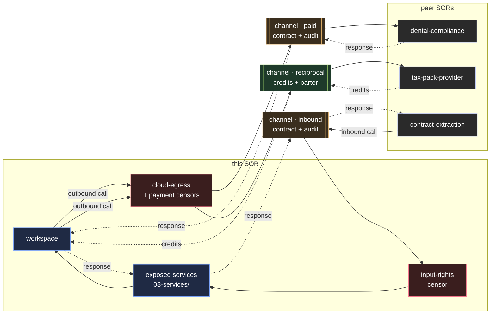

# Channels

Society channels are governed agreements for SOR-to-SOR service relationships.

This SOR may call services from other societies, and other societies may call services from this SOR.



---

## What a Society Channel is

A Society Channel is not just an API integration. It is a governed cognitive transaction with:

```text
service contract (what is being exchanged)
input rights (what may be sent)
output rights (what is received and what the provider may retain)
pricing or reciprocal credits
privacy terms
audit trace
dispute window
reputation tracking
```

Both parties must agree to the terms before any transaction occurs.

---

## Channel registry

*No external channels have been registered yet.*

When a channel is established, a YAML file is added here for each partner SOR.

---

## Adding a channel

Adding a new Society Channel requires:
1. Reviewing the partner SOR's published service contract
2. Verifying privacy terms are acceptable
3. Registering the channel in this directory (PR with human approval)
4. Ensuring the cloud-egress-censor is configured for the channel
5. Adding the spending limit to the payment-censor

---

## Reciprocal agreements

See [reciprocal-agreement.example.md](reciprocal-agreement.example.md) for the format of a reciprocal (barter) agreement.

---

## Full channel protocol

See [../02-protocols/07-service-channel.md](../02-protocols/07-service-channel.md).
